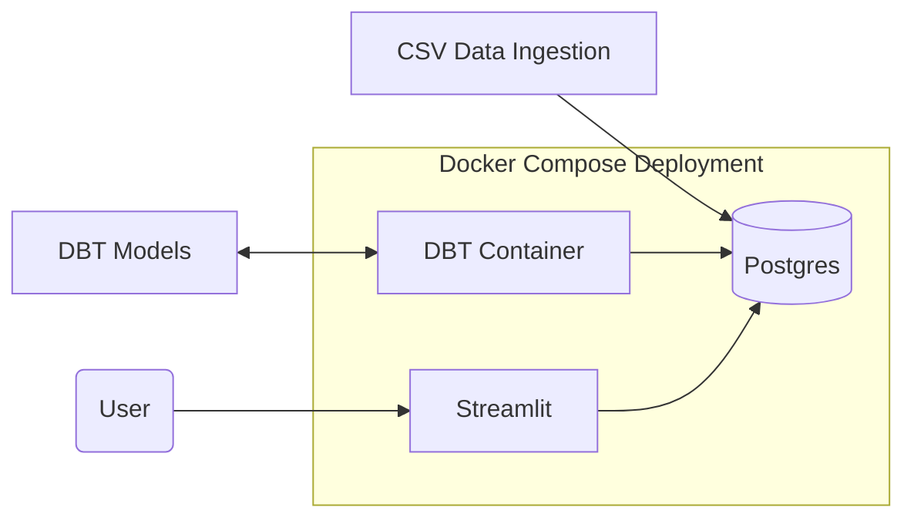
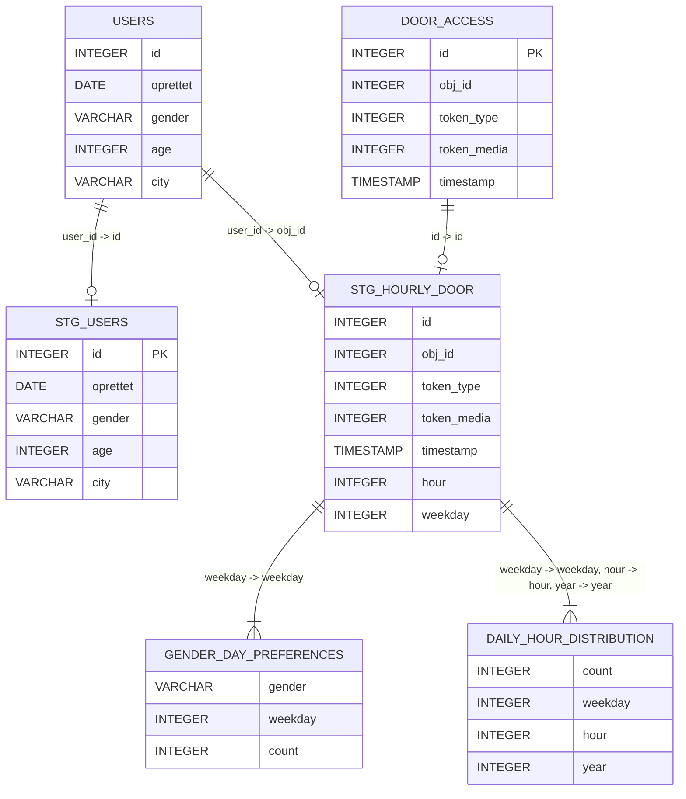

```mermaid
flowchart LR

		User(User)
		DM[DBT Models]		
    DBT[DBT Container]

    Ingestion[CSV Data Ingestion] --> PSQL 

    DM[DBT Models] <--> DBT
    DBT --> PSQL[(Postgres)] 


    User --> Streamlit
		Streamlit --> PSQL

    subgraph Docker Compose Deployment
        PSQL
        DBT
        Streamlit
    end

```

```mermaid
erDiagram
    USERS {
        INTEGER id 
        DATE oprettet
        VARCHAR gender
        INTEGER age
        VARCHAR city
    }

    DOOR_ACCESS {
        INTEGER id PK
        INTEGER obj_id
        INTEGER token_type
        INTEGER token_media
        TIMESTAMP timestamp
    }

    STG_USERS {
        INTEGER id PK
        DATE oprettet
        VARCHAR gender
        INTEGER age
        VARCHAR city
    }

    STG_HOURLY_DOOR {
        INTEGER id 
        INTEGER obj_id
        INTEGER token_type
        INTEGER token_media
        TIMESTAMP timestamp
        INTEGER hour
        INTEGER weekday
    }

    GENDER_DAY_PREFERENCES {
        VARCHAR gender
        INTEGER weekday
        INTEGER count
    }
    
    DAILY_HOUR_DISTRIBUTION {
        INTEGER count
        INTEGER weekday
        INTEGER hour
        INTEGER year
    }


    USERS ||--o| STG_USERS: "user_id -> id"
    DOOR_ACCESS ||--o| STG_HOURLY_DOOR: "id -> id"
    USERS ||--o| STG_HOURLY_DOOR: "user_id -> obj_id"
    STG_HOURLY_DOOR ||--|{ GENDER_DAY_PREFERENCES: "weekday -> weekday"
    STG_HOURLY_DOOR ||--|{ DAILY_HOUR_DISTRIBUTION: "weekday -> weekday, hour -> hour, year -> year"

```

